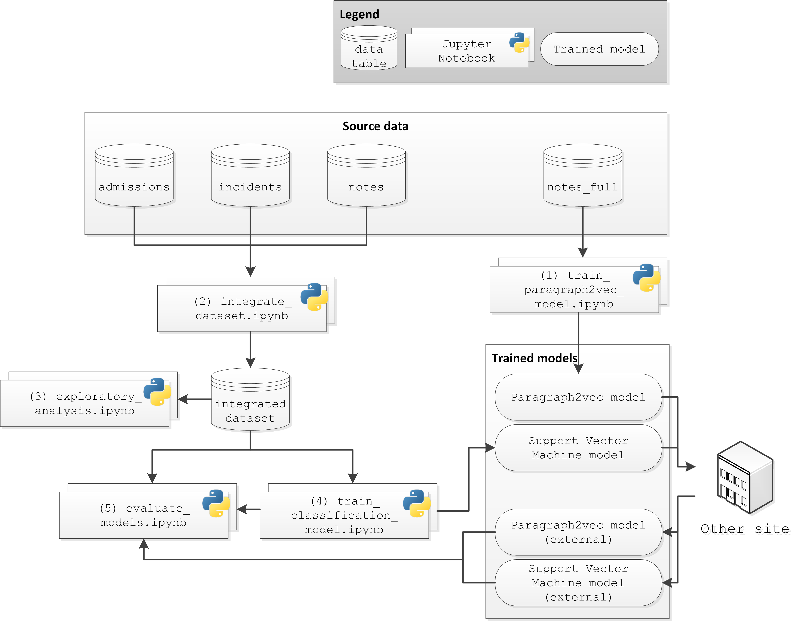

## Outline
1. Introduction
2. Process overview
3. Notebook descriptions
4. Input data

## 1. Introduction
This repository contains code, predictions and logs for the manuscript that has been submitted for publication as: 

Menger, V., Spruit, M., van Est, R., Nap, E., Psydata group, Scheepers, F. (2019). *Inpatient violence risk assessment using routinely collected clinical notes in Electronic Health Records: a machine learning approach*.

The analysis code consists of a collection of Jupyter notebooks that preprocess data, perform exploratory analysis and machine learning modeling, and evaluate outcomes using Python. Additionally, all output logs and predictions for both sites are available in the `logs` folder.

## 2. Process overview
A schematic depiction of the relations between data, notebooks and trained models can be seen below. 

## 3. Notebook descriptions

The following notebooks are included in this repository. 

| Notebook | Description |
|--|--|
| `train_paragraph2vec_model.ipynb` | Processes the texts in the `notes_full` dataset, and then trains a `paragraph2vec` model. |
| `integrate_dataset.ipynb` | Processes and integrates the `admissions`, `incidents` and `notes` datasets. 
| `exploratory_analysis.ipynb` | Performs exploratory analysis on the integrated dataset. 
| `train_classification_model.ipynb` | Trains a classification model using the integrated dataset, and produces an internal prediction using cross validation. | 
| `evaluate_models.ipynb` | Evaluates model performance, both  the cross validated prediction, and a prediction using models that were externally trained on a similar dataset. 

## 4. Input data
The scripts assume as input the four data tables with specified columns.

1. `admissions` This data table contains a set of admissions, that are assumed to be relevant for the classification task. 

| Column name | Description |
|--|--|
| `patient_id` | An identifier for patients across data tables |
| `admission_id` | A unique identifier for admissions | 
| `start_datetime` | The start datetime of admission | 
| `end_datetime` | The end datetime of admission

2. `incidents` This data table contains a set of incidents of patients included in the `admissions` dataset

| Column | Description |
|--|--|
| `patient_id`| An identifier for patients across data tables |
| `incident_id` | A unique identifier for incidents | 
| `datetime` | The datetime of the incident | 

3. `notes` This data table contains a set of clinical notes of patients included in the `admissions` dataset

| Column | Description |
|--|--|
| `patient_id` | An identifier for patients across data tables |
| `note_id` | A unique identifier for notes | 
| `datetime` | The datetime of the clinical note | 
| `text` | The raw text of the clinical note | 

4. `notes_full` This data table consists of a large set of clinical notes, not necessarily included in the `admissions` dataset, used for training a paragraph2vec model for representing clinical notes. 

| Column | Description |
|--|--|
| `text` | The raw text of the clinical note |
| `label` | A label for the unsupervised learning task, can be arbitrary | 
